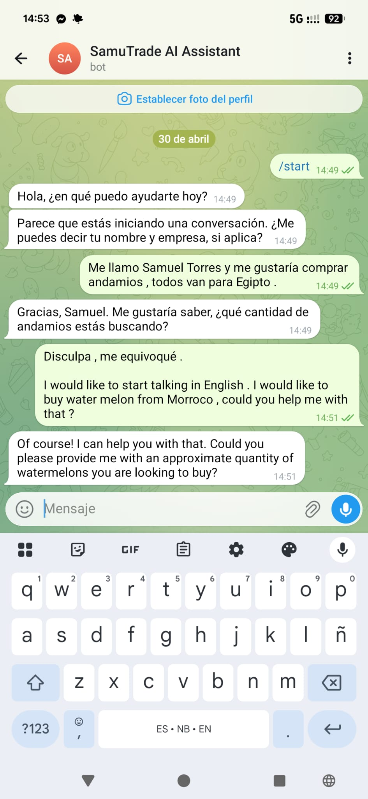
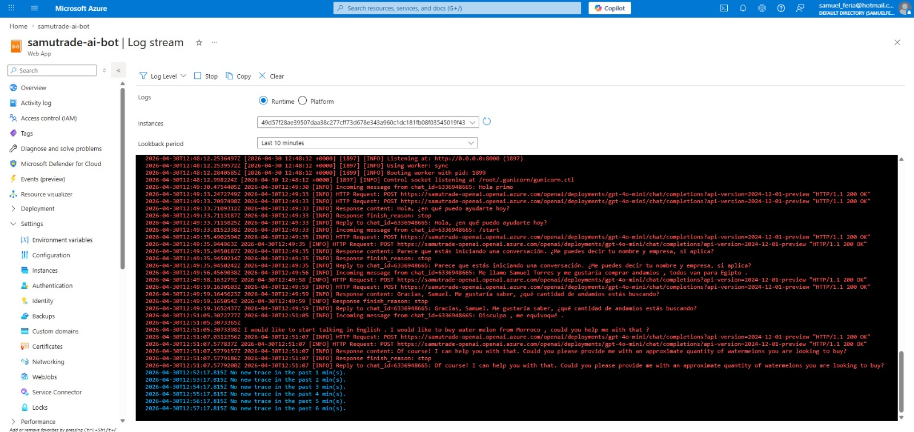

# SamuTrade AI Bot

Multilingual Telegram bot that qualifies B2B leads for an international
trade brokerage. It does not invent prices or commitments — it gathers
structured data and prepares the case for a human agent.

**Live:** [@SamuTradeAI_bot on Telegram](https://t.me/SamuTradeAI_bot)

## What it does

1. Receives a Telegram message via webhook.
2. Calls Azure OpenAI (`gpt-4o-mini`) twice:
   - **`extract_lead_data`** — parses the conversation into structured JSON
     (name, client type, product, quantity, origin, destination, budget, urgency, blockers, interest).
   - **`get_chat_reply`** — generates the next conversational turn in the
     user's language.
3. Sends the reply back through the Telegram Bot API.
4. Once enough fields are filled, produces a lead summary for the human agent.

## Why this exists

The founder handles international trade inquiries across several languages
and time zones. The bot pre-qualifies leads 24/7, so the human only engages
when a real business opportunity is already structured.

## Tech stack

| Layer       | Technology                                      |
|-------------|-------------------------------------------------|
| Bot API     | Telegram Bot API (webhook mode)                 |
| Runtime     | Python 3.12, Flask, Gunicorn                    |
| AI          | Azure OpenAI `gpt-4o-mini` (`2024-12-01-preview`) |
| Hosting     | Azure App Service Linux B1, West Europe         |
| Auth        | Environment variables (no key vault for now)    |

## Architecture

```
Telegram user
     │  HTTPS POST /telegram-webhook
     ▼
Flask app  (server_telegram.py)
     │
     ├─► extract_lead_data()  ──► Azure OpenAI  ──► structured JSON
     │                                               (stored in sessions{})
     └─► get_chat_reply()     ──► Azure OpenAI  ──► natural-language reply
                                                         │
                                              Telegram Bot API ──► user
```

State is held in memory (`sessions` dict keyed by `chat_id`). No database yet.

## Features

- Auto-detects the user's language and replies in it (Spanish, English,
  French, Portuguese, Arabic, etc.)
- Gathers lead data through natural conversation, one question at a time
- Never invents prices, stock, or commitments — redirects to a human quote
- Maintains per-conversation context in memory by `chat_id`
- Generates a structured lead summary once enough data is captured

## Screenshots

**Live multilingual conversation**



**Azure App Service production logs**



## Setup (local)

```bash
git clone https://github.com/SamuTechAI9/samutrade-ai-bot.git
cd samutrade-ai-bot

python -m venv .venv
source .venv/bin/activate          # macOS / Linux
.venv\Scripts\activate             # Windows PowerShell

pip install -r requirements.txt

cp .env.example .env               # fill in real values
python server_telegram.py
```

To receive real Telegram messages locally, expose port 5000 with ngrok and
register the webhook:

```
https://api.telegram.org/bot<TOKEN>/setWebhook?url=<NGROK_URL>/telegram-webhook
```

### Required environment variables

| Variable                        | Description                          |
|---------------------------------|--------------------------------------|
| `TELEGRAM_BOT_TOKEN`            | From @BotFather                      |
| `AZURE_OPENAI_ENDPOINT`         | Your Azure OpenAI resource endpoint  |
| `AZURE_OPENAI_API_KEY`          | API key                              |
| `AZURE_OPENAI_DEPLOYMENT`       | Deployment name (e.g. `gpt-4o-mini`) |

## Production

| Component       | Value                                                                 |
|-----------------|-----------------------------------------------------------------------|
| Hosting         | Azure App Service Linux B1, West Europe                               |
| App name        | `samutrade-ai-bot`                                                    |
| Startup command | `gunicorn --bind 0.0.0.0:8000 --timeout 120 server_telegram:app`     |
| Resource group  | `samutrade-ai`                                                        |
| OpenAI resource | `samutrade-openai` (deployment: `gpt-4o-mini`)                       |

## Project structure

```
SamuTrade_AI/
├── server_telegram.py   # production Telegram webhook (active)
├── server.py            # legacy WhatsApp/Twilio version (reference only)
├── requirements.txt
├── .gitignore
└── docs/
    └── screenshots/
        ├── conversation-multilang.png
        └── azure-logs.png
```

## Status & roadmap

**Running in production.**

| Done | Item |
|------|------|
| ✅ | Telegram webhook on Azure App Service |
| ✅ | Multilingual replies via Azure OpenAI |
| ✅ | Structured lead extraction (JSON) |
| ⬜ | Persistent lead storage (Cosmos DB or SQLite) |
| ⬜ | Push notification to human agent on qualified lead |
| ⬜ | Lead-review dashboard |
| ⬜ | `src/` package layout via staging slot |
| ⬜ | WhatsApp Business API (pending company registration) |

## About

Built by **Samuel Torres Nebro** — international trader moving into AI and
cloud development. Based in Trondheim, Norway.

[LinkedIn](https://www.linkedin.com/in/samuel-torres-0a882b292) ·
[Email](mailto:samueltorressorser@gmail.com)

## License

MIT
